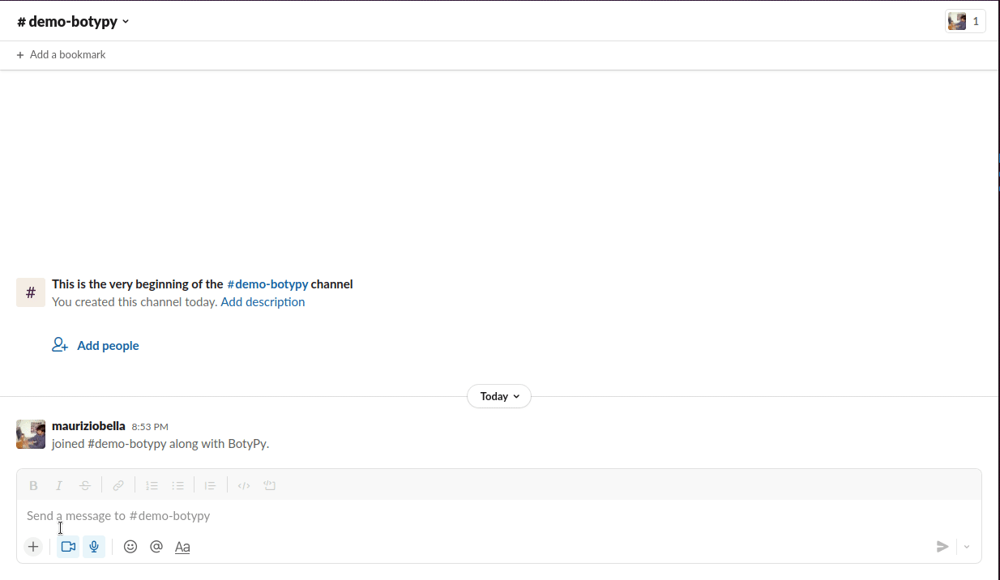

# BotyPy

**BotyPy** is a Python BOT, based on the [slack_bolt](https://slack.dev/bolt-python/api-docs/slack_bolt/), interfacing with the Slack platform in Socket Mode using the Events API. It implements events on app mentions ("app_mention") and direct messages ("message") queueing jobs and processing them in the background with workers using [RQ](https://python-rq.org/) (Redis Queue) 

## Demo


## Functionalities
### Extract keywords
- Extract keywords from users' Slack messages using [KeyBERT](https://github.com/MaartenGr/KeyBERT) and respond to the user with the result found on the web (e.g., from Google)


## 0. Configuration

### Slack


### config file (.env file)

- REDIS_URL= **Required** Redis URL used by Python RQ (e.g. redis://localhost:6379)
- SLACK_APP_TOKEN= **Required** [App-level tokens](https://api.slack.com/authentication/token-types) represent your app across organizations, including installations by all individual users on all workspaces in a given organization. (begins with xapp*)
- SLACK_BOT_TOKEN=**Required** [Bot tokens](https://api.slack.com/authentication/token-types) represent a bot associated with the app installed in a workspace. Unlike user tokens, they're not tied to a user's identity; they're just tied to your app.(begins with xoxb*)
- LOGGING_LEVEL= Standard levels and their applicability are described [here](https://docs.python.org/3/howto/logging.html)
- GOOGLE_SEARCH_API_KEY=Custom Search JSON API requires the use of an API key. An API key is a way to identify your client to Google.
- GOOGLE_CSE_ID=Google Programmable Search Engine ID, provided by Google that allows web developers to feature specialized information in web searches
## 1. Quickstart (localhost)
1. Start [REDIS](https://redis.io/) (e.g., redis://localhost:6379)
2. Rename env_template to .env and change it
3. Run these commands from the terminal
```
pip install -r requirements.txt
python worker.py
python socket_client.py #from another terminal
```
4. Start sending a slack message to your bot
## 2. Quickstart (heroku)
[](https://heroku.com/deploy?template=https://github.com/MaurizioBella/pyslack-bot)
- Once deployed, open the Heroku [logs](https://devcenter.heroku.com/articles/logging), and you are good to start sending a slack message to your bot.
- There are 2 [process types](https://devcenter.heroku.com/articles/procfile) defined in the Procfile: worker and socket

# 3. Extra
- you might need to specify the pytorch - here an eaxmple:
```
pip install torch==1.9.0+cu111 torchvision==0.10.0+cu111 torchaudio==0.9.0 -f https://download.pytorch.org/whl/torch_stable.html
```
- Useful Heroku commands
```
heroku run -a <app_name> -- rq info --interval 0.5 #Monitoring RQ queue on Heroku
heroku ps:scale worker=1 socket=1 --app <app_name> #scale the dynos
heroku logs --tail --app <app_name> #check the logs
```
